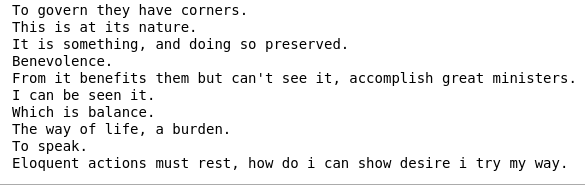
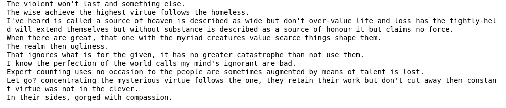
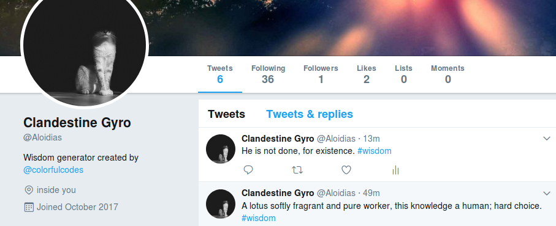

# Markov-Sentence-Generator

This sentence generator uses a Markov Chain to create new sentences from the books of "Proverbs", "Dharmasala" and "Tao te Ching".
I will be using a matrix to determine the frequency of words that follow other words most commonly. I will be adding one more major religious wisdom text. This should be interesting as another text would bring forth a new philosophy and more of a unique fusion.

Twitterbot is @Aloidias. Please, join us.

